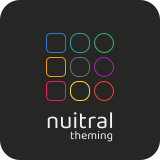

  <picture>
    <source media="(prefers-color-scheme: dark)" srcset="./media/logo-theming-dark-mode.svg" width="150" height="150" />
    <source media="(prefers-color-scheme: light)" srcset="./media/logo-theming-light-mode.svg" width="150" height="150" />
    
  </picture>

<b>nuitral theming</b> is part of the <b>nuitral</b> suite and handles theming creation.

It takes advantage of the power of SCSS and the flexibility of CSS to provide the best development experience.

<b>Status:</b> This project is currently in <b>alpha version</b>.

---

### 🔗 Suite

This library is part of the **nuitral** suite, a native UI toolkit designed to build modern, flexible, and high-performance interfaces.

Explore the suite → https://nuitral.github.io

---

### License

This project is licensed under the [MIT License](https://github.com/nuitral/theming/blob/main/LICENSE).

Copyright (c) 2025 **Nicola Centonze**
